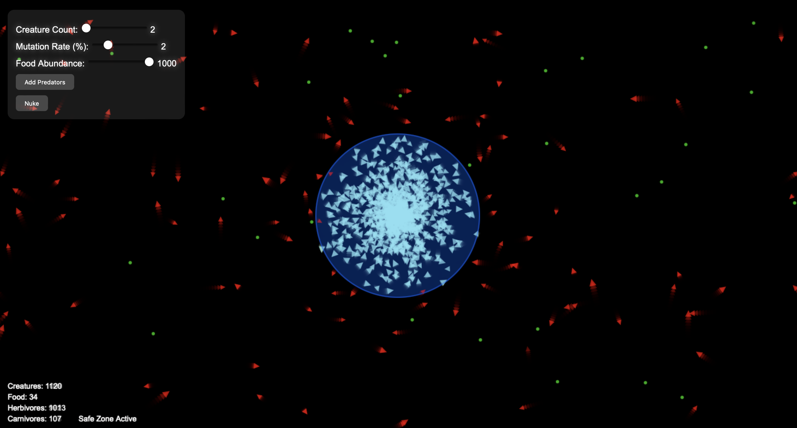

# Underwater Biome Simulation! 🌊🦈🐠...☢️

-- --
Welcome to this little **Biome Simulation**! To get started, simply open the provided `biomeSim.html` file, copy it into an html file, and get it running in your favorite web browser. Once running, it will automatically start the simulation. **I recommend letting the simulation run on its own, for it is pretty much optimized to be self-sustaining.**
-- --
You will see a control panel on the top-left corner where you can adjust the number of creatures, mutation rate, and food abundance using the sliders. 

For now, you can either let it go on its own, or click the mouse to add lots of food for the little blue creatures 🐠. After the screen is swarming with little creatures and food is going fast, you will notice that there is an equilibrium point that the creature population reaches. Don't worry, I've made things more interesting, and that interesting thing will happen when the system is stabilized. Carnivores 🦈 come out to feed! This is when the sim gets kind of fun to look at!

Once the herbivore population is below a third the amount of the carnivore population, a safe zone will appear, and the herbivores will gather inside and reproduce until they are let free and quickly eaten again. This creates a really nice cycle that is fun to watch. Once you're done watching this, you can use the "Nuke" button to trigger a dramatic event that wipes out everything and resets the map. 

Monitor the real-time statistics displayed at the bottom-left to observe the population dynamics of herbivores and carnivores. Experiment with different settings to see how various factors influence the balance of the ecosystem. 

## How It Works

The **Ecosystem Simulation** models the interactions between two types of creatures: **herbivores** and **carnivores**. Herbivores roam the canvas searching for food sources to maintain their energy levels and reproduce. Carnivores hunt herbivores to survive, adding a layer of predation to the ecosystem. Both creature types have attributes like speed, perception radius, and mutation rates that affect their behavior and evolution over time.

### Control Panel Features

- **Creature Count:** Adjusts the total number of creatures in the simulation. Increasing the number introduces more herbivores and carnivores, while decreasing it reduces their population.
- **Mutation Rate (%):** Determines the likelihood of genetic mutations during reproduction, leading to variations in creature traits such as speed and perception.
- **Food Abundance:** Sets the number of food sources available. More food supports a larger herbivore population, whereas less food can lead to competition and scarcity.
- **Add Predators:** Introduces additional carnivores into the ecosystem, increasing the hunting pressure on herbivores.
- **Nuke:** Activates a catastrophic event that affects creatures within the safe zone. This can drastically alter the population dynamics by eliminating certain creatures.

### Interactive Canvas

- **Adding Food:** Move your mouse while holding down the left button to continuously add food sources at the cursor's location. Clicking once creates a large cluster of food within a specific radius, providing abundant resources in that area.
- **Safe Zone:** A central area that influences creature behavior. When active, herbivores are attracted to it for safety and increased reproduction, while carnivores are repelled, reducing their hunting efficiency within the zone.

### Creature Behavior

- **Herbivores:** Seek out food to gain energy, reproduce when energy levels are high, and avoid carnivores to survive. Their movement and reproduction rates can change based on the environment and mutation rate.
- **Carnivores:** Hunt herbivores to sustain their energy, reproduce less frequently, and have higher speed and perception to effectively locate prey. Their presence keeps the herbivore population in check.

### Nuke Feature

When activated, the **Nuke** creates an explosion from the safe zone's center, eliminating all creatures. This feature allows you to reset or drastically change the ecosystem's balance, providing a powerful tool to observe how populations recover and adapt post-catastrophe.

### Real-Time Statistics

The simulation displays key statistics at the bottom-left corner, including the total number of creatures, food sources, herbivores, and carnivores. Additionally, it indicates whether the safe zone is currently active. These metrics help you understand the current state of the ecosystem and make informed adjustments using the control panel.

### Dynamic Ecosystem

The simulation continuously evolves based on the interactions between creatures, food availability, and environmental factors like the safe zone and nuke events. Observing these dynamics provides insights into ecological balance, predator-prey relationships, and the impact of environmental changes on populations.

Enjoy experimenting with different settings and witnessing how your virtual ecosystem thrives, adapts, and evolves!
